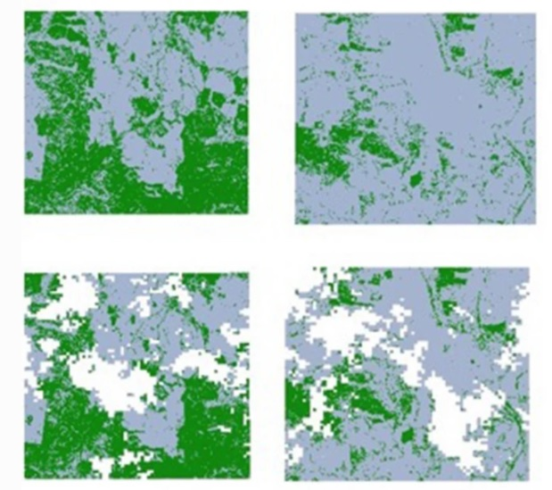
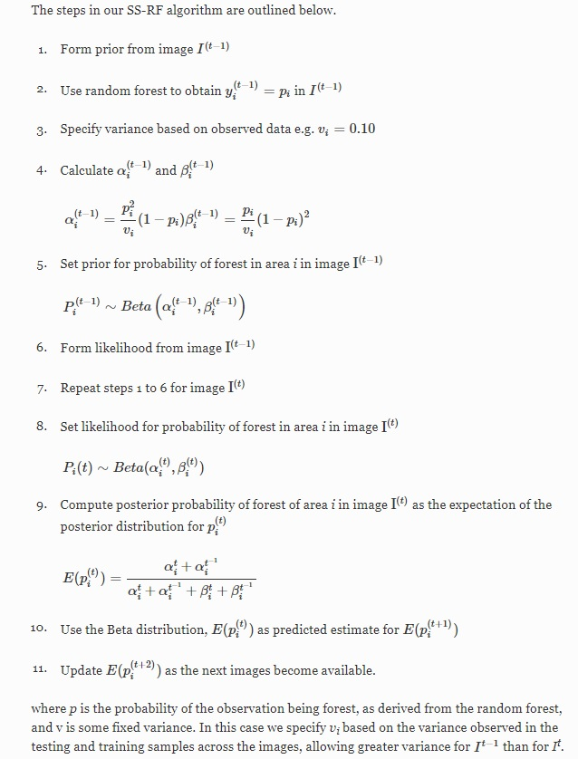

```{r global_options, message=FALSE, results= 'hide', echo= FALSE}
knitr::opts_chunk$set(fig.width=12, fig.height=8, fig.path='Figs/',
                      results='hide', warning=FALSE, message=FALSE)
```
The purpose of this document is to provide guidance about how to implement our **Stochastic spatial random forest (SS-RF) method** for filling missing data in satellite images due to clouds. 

For more details of our method, please see our open access [paper](https://link.springer.com/article/10.1186/s40537-020-00331-8) in the Journal of Big Data:  
If you do use our method **please cite our original paper**. A suggested format is:
Holloway-Brown, J., Helmstedt, K. J., & Mengersen, K. L. (2020). Stochastic spatial random forest (SS-RF) for interpolating probabilities of missing land cover data. Journal of Big Data, 7(1), 55. https://doi.org/10.1186/s40537-020-00331-8 

This document includes the steps to fit our method and produce probabilities of land cover, which I also convert to a binary classification. Before fitting the SS-RF method, I prepare my image data using a process similar to the one outlined in my [previous tutorial](https://github.com/thejholloway/raster2data) about converting a satellite image to a data frame and calculating variables. In our paper we calculated Normalised Differenced Vegetation Index (NDVI) which is a measure of 'greenness' of vegetation, and converted that to forest and not forest. See for example this following figure from the paper: we identified forest cover (green) and not forest (grey) in the areas with simulated clouds (white). 

{width=30%}

After preparing the current and past images as dataframes, I train random forest algorithms to predict probabilities of forest and not forest cover for the same pixels at each point in time. I save these predictions for each sample of missing data, which are what are being loaded in this example. Producing these input probabilities from is not included in this tutorial and can be produced by the user. I used the [randomForest package](https://cran.r-project.org/web/packages/randomForest/randomForest.pdf) in R.

Please note I set this up to run multiple samples of data in parallel on my university's HPC. This version of the code has been simplified to run on a local machine.  

I have included some very small files to use for a toy example for simplicity. It is worth noting that although for the real data I ran the method on hundreds of thousands of pixels this code took less than 10 minutes to produce results.

Now, to the code: I have made the process to construct the Beta distributions straightforward to run.

Require packages data.table, randomForest and caret. Note: I normally use data.table because it is faster to read the large .csv files I store the samples of image data in. For this example I have made small csv files so it is not needed.  

```{r }
library(data.table)
library(randomForest)
library(caret)
```
Read in the probabilities of forest for current image (t) and past image (t-1) predicted by random forest models.

```{r }
data.t <-read.csv(file='current_probs.csv', header=TRUE)
data.past <-read.csv(file='past_probs.csv', header=TRUE)
prob <-data.t$Forest
prob.past <- data.past$Forest

```
Calulate prior mean for the current image, t: p = alpha/alpha + beta
Calculate alpha using p from the random forest and v 
alpha = p^2/v*(1-p)

```{r }
v <-0.01

a <- prob^2/v*(1-prob)
```
Calculate beta using p from the random forest and v 
beta=p/v * (1-p)^2
```{r }

b <- prob^2/v*(1-prob)
```
Note, v for t is set at .01, and v for t-1 is set to .02 based on averages in data. The value of v will change the values of alpha and beta, and can be set by the user. 

Repeat this process for the second image, t-1. We will label these alphas, betas and v as 'past' 
```{r }
v.past <- 0.02

a.past <- prob.past^2/v.past*(1-prob.past)

b.past <- prob.past/v.past * (1-prob.past)^2
```
Calculate the expected value of the Beta distribution of each pixel for both the current image t and past image t-1. 
```{r }
posterior.prob <-(a + a.past)/(a +a.past + b + b.past)

summary(posterior.prob)
```
Set any Nan values to 0 as they are a result of zero values in alpha and beta
```{r }
posterior.prob[is.nan(posterior.prob)] <- 0
```
The object posterior.prob gives the posterior probability of each pixel being forest in future image t+1, based on the probability of forest in image t, given what we know about that pixel in the past at time t-1.  

Load the file of the future data which we are predicting. In our case study we had simulated our own clouds so knew the true class values of the pixels. For really missing data you will not know the true values so will not be able to perform the final model accuracy assessment we do next.

```{r }
data.future <-read.csv('future_probs.csv', header=TRUE)
```

Merge the posterior probabilities and future datasets.

```{r }
df <-cbind(data.future,posterior.prob)

```
Next, convert these probabilities of forest cover to a binary classification: forest and not forest for each pixel. Note: I do this using a threshold of 0.5 but you could use others.

```{r }
df$post_class <-c(ifelse(!is.na(df$posterior.prob) & df$posterior.prob>=0.5, "Forest", "Not_forest"))
df$post_class <-as.factor(df$post_class)
df$Class <-as.factor(df$Class)
```

Make a confusion matrix of the predictions from the model, post_c

```{r }
#
confu <-confusionMatrix(df$Class, df$post_class)

confu

```
Option to save the outputs of the confucion matrix. 
```{r }
classifications <-as.table(confu)
write.csv(classifications, "classifications.csv")

results <-as.matrix(confu,what="overall")
write.csv(results,"overall_accuracy.csv")

results2<- as.matrix(confu, what = "classes")
write.csv(results2, "accuracy_by_class.csv")

```
For each pixel you now have a probability it belongs to the forest class and a classification as forest and not forest. This method could be used to classify other binary land cover. We have also since extended the method to multiple classes in a paper which is currently under review. 

For interested readers the algorithm for our SS-RF method is here (also in Appendix 1 of our paper). 


